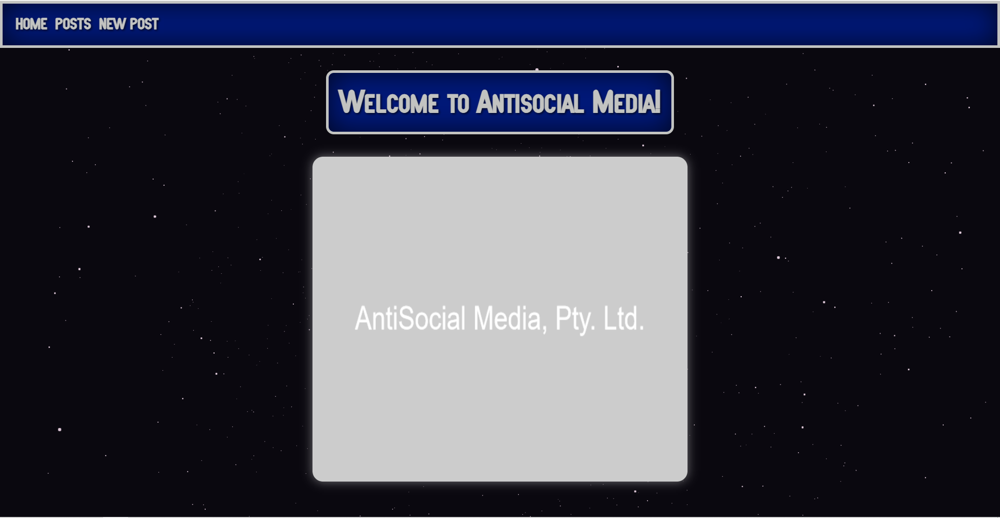
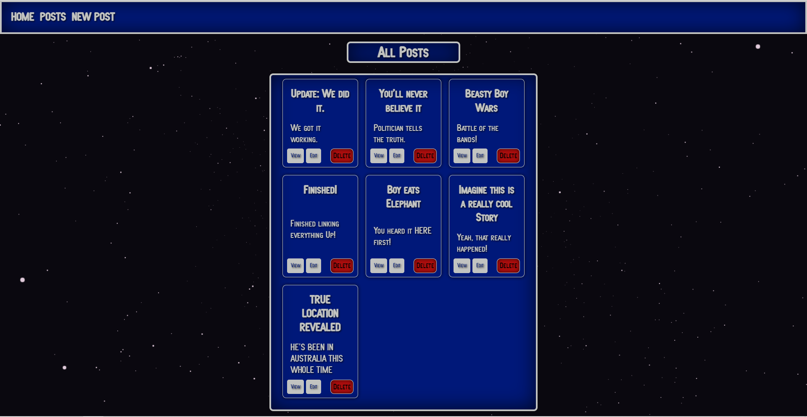
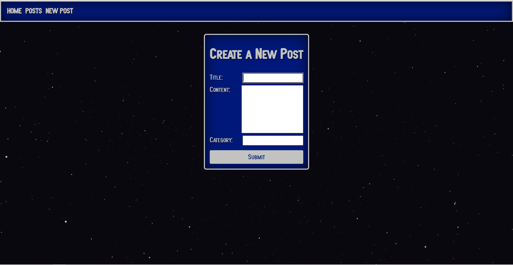

<h1 style="font-weight: 900"> AntiSocial Media [Full-stack Practise] </h1>

This is a mock 'blog' that recycled a lot of previously used components and allowed for me to practise working with a full-stack app. It's not the nicest app but it was great practise and taught me a lot about full-stack development (on a very small scale)

<h1 style="font-weight: 900"> Screenshots </h1>

## 1. Welcome to Antisocial Media

## 2. What's Happening in the World?

## 3. Don't Like What You Read? Change It! Make Something Up!

## What did I use to create it?

This project uses:

-   React (HTML, SCSS, etc.)
-   SpringBoot
-   mySQL

## Features of the Project:

-  Users can see all the posts that have previously been written.
-  Users are able to add, delete and edit  posts 

<h1 style="font-weight: 900"> Here are some of the lessons I learnt:</h1>

### Creating a Full Stack App:

### Understanding the process:

-  Now, being able to understand the entire process is incredibly helpful and has definitely changed the way I think when developing frontend and/or backend systems. 

### Using different languages:

- The front end used React while the back end was in Java; however, the process of 'linking' them up with one another was relatively straight forward (after taking in considerations for CORS. database location, etc.). 

## I have some questions:

- While developing this app, realised that there was a lot being done for me behind the scenes and sometimes there were settings or dependencies just arbitarily added. I would like to have a better understanding of these concepts.

## What's next?:

-   [ ] Use what I've learnt to create more intricate full-stack apps 
-   [ ] Try out other languages (e.g. Next.js)

## Thank You!

Thank you for taking the time to look at this project. I really hope you enjoy it.
Feel free to reach out and ask any questions.

[Tim Broderick]
